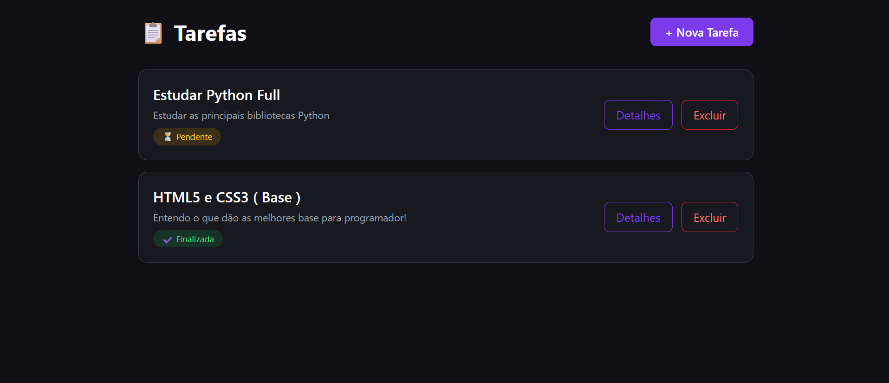
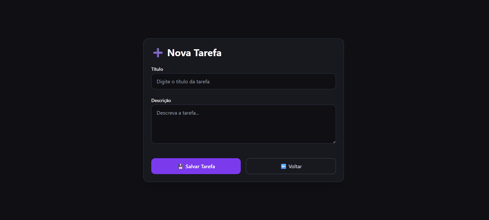
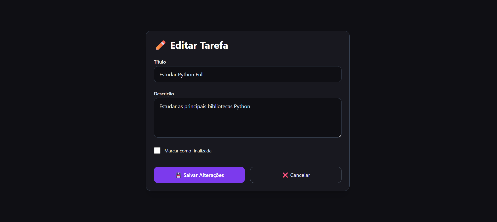

# ✅ Lista de Tarefas – Django + TailwindCSS

Projeto simples e moderno de **lista de tarefas** desenvolvido com **Django 3** + **TailwindCSS**, com suporte a **dark mode** (tema preto + roxo) e design 100% responsivo.

> 🎓 Ótimo para quem está começando com Django!

<!-- Ou use GIF se preferir -->

## 📸 Telas do projeto

### Home - Lista de tarefas        
 

### Nova tarefa
 

### Editar tarefa             |
 

### Detalhes da tarefa


## 🛠️ Tecnologias Utilizadas


- Python 3.8+
- Django 3.x
- SQLite (padrão)
- Tailwind CSS (via CDN)
- HTML5 + JavaScript básico

## Funcionalidades Principais

- ✅ Criar novas tarefas
- ✅ Editar tarefas existentes
- ✅ Excluir tarefas
- ✅ Marcar/desmarcar como concluída
- ✅ Design moderno com **Dark Mode**
- ✅ Totalmente responsivo (mobile, tablet e desktop)
- ✅ Interface limpa e intuitiva

## 🚀 Como rodar o projeto localmente

```bash
# 1. Clone o repositório
git clone https://github.com/SEU-USUARIO/SEU-REPOSITORIO.git

# 2. Entre na pasta do projeto
cd SEU-REPOSITORIO

# 3. Crie e ative o ambiente virtual
# Linux / macOS
python3 -m venv venv
source venv/bin/activate

# Windows (cmd)
python -m venv venv
.\venv\Scripts\activate

# Windows (PowerShell)
.\venv\Scripts\Activate.ps1

# 4. Instale as dependências
pip install django

# 5. Aplique as migrações
python manage.py migrate

# 6. (Opcional) Crie um superusuário
python manage.py createsuperuser

# 7. Inicie o servidor
python manage.py runserver

Depois abra no navegador:
→ http://127.0.0.1:8000
📌 Observações importantes

O projeto usa SQLite por padrão (não precisa configurar banco externo)
Todo o estilo foi feito com TailwindCSS via CDN (sem necessidade de build)
Ideal para: portfólio, estudos iniciais com Django, primeiros projetos fullstack

📄 Licença
Este projeto está sob a licença MIT - sinta-se à vontade para usar, modificar e distribuir.


> #### Projeto desenvolvido durante a orientação do [Felipe Rocha](https://youtube.com/@felipemrocha)  