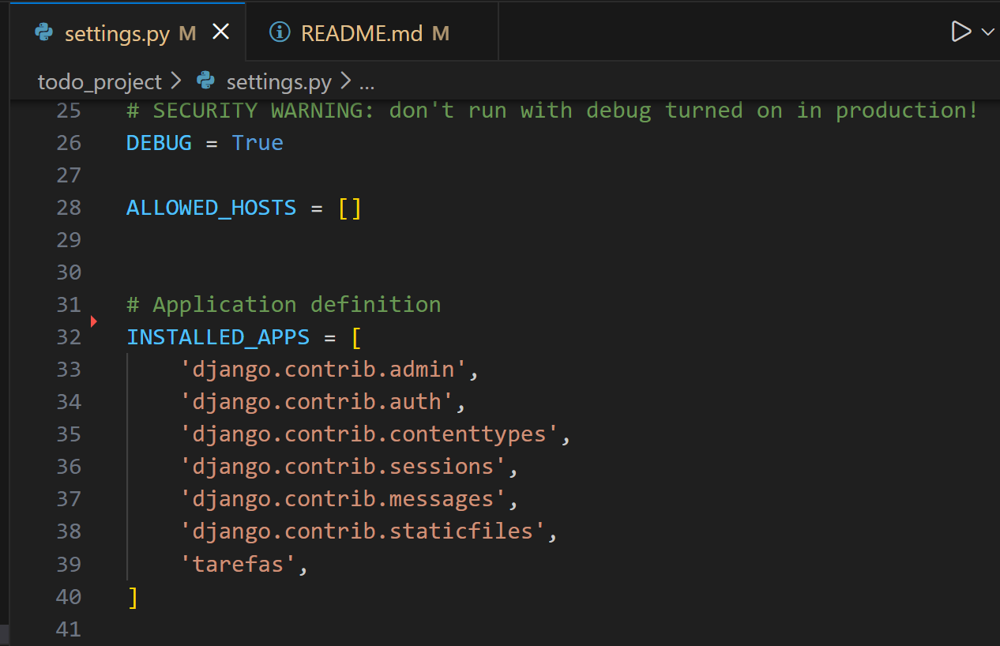
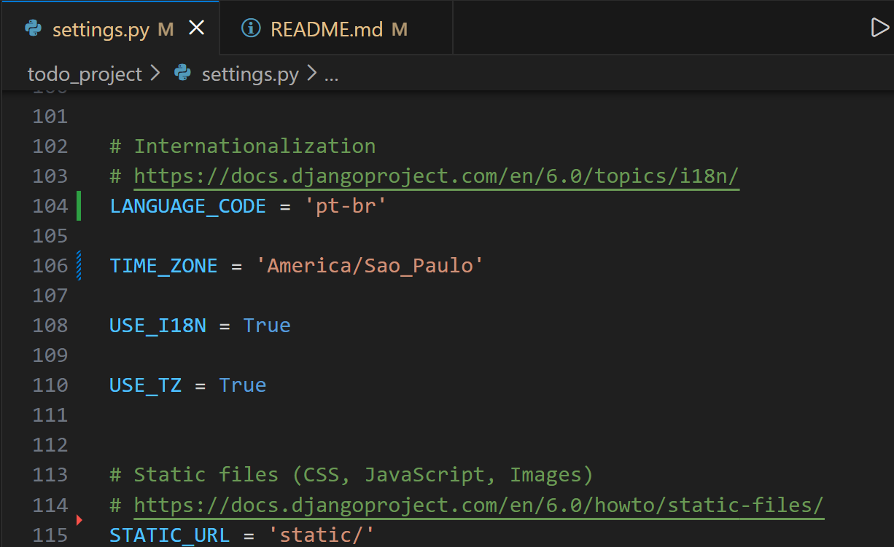
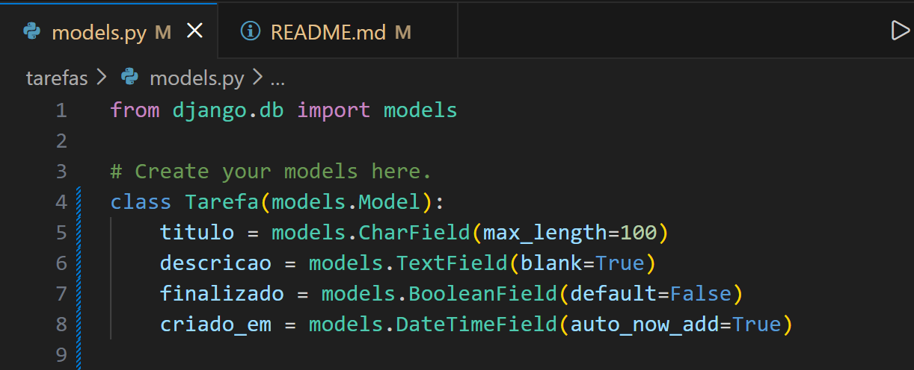
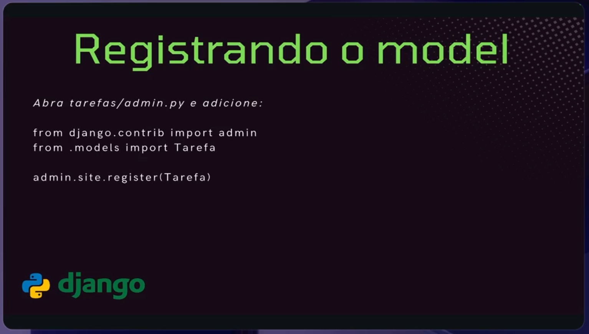
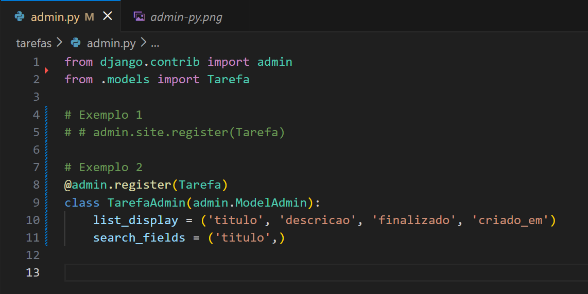

> # 1. Criando Virtual Env Windows

> # 1.1 Ativando Virtual Env Windows
```
python -m venv venv
```

```
.\venv\Scripts\activate
```

> # 2. Django create project
> * Instalando django
```
python -m pip install django
```

> # 3 Criando projeto Django
```
django-admin startproject todo_project .
```

> # 4 Criando modulo Tarefas
```
python manage.py startapp tarefas
```

> # 5 Ativando o modulo Tarefas no settigs.py


> * Rodando migrate
```
python manage.py migrate
```

> * Rodar aplicação
```
python manage.py runserver
```

> * URL Inicial
```
http://127.0.0.1:8000/
```

> # 6 Config Time


> # 7 Criando um usuário admin
```
python manage.py createsuperuser
```

> * URL Admin
```
http://127.0.0.1:8000/admin
```

> * Cria a uma tabela models.py

```
from django.db import models
```

# Create your models here.
```
class Tarefa(models.Model):
    titulo = models.CharField(max_length=100)
    descricao = models.TextField(blank=True)
    finalizado = models.BooleanField(default=False)
    criado_em = models.DateTimeField(auto_now_add=True)
```

> * Roda a migration para gerar a tabela do Model
```
python manage.py makemigrations
```

> * Cria a tabela
```
python manage.py migrate
```

# Registrando um Model Tarefa


# Definindo um modulo melhor de view para a tarefa no painel
